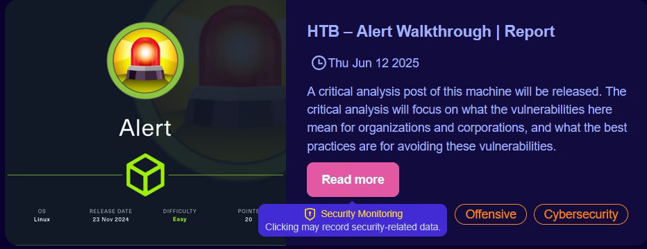

Dear Surprisingly High Number of Daily Human Visitors,

For quite some time, I have been working on developing a new website. I would like to share a couple of things about it, including screenshots. The website in question is going to replace this website at this domain, https[:]//0xinfinity.dev.

The main purpose of this website is to share my opinion and journey on cybersecurity and cybersecurity governance. Therefore I would like to discuss a bit about my design choices, and principles, with a specific focus on cybersecurity and ethical cybersecurity.
# Privacy / IP Collection Stance
> ### TL;DR 
> The web application does not have access to your IP address through Convex backend. Instead, it uses session-based security tracking system. Your IP address is only stored for 14-30 days on infrastructure-level Access Logs.
## Infrastructure-level Privacy
Most websites, mine included, record your IP address when you access it. These logs are called “Access Logs”, and generated by an underlying web server (like NGINX, Apache2). Each URI you visit is recorded along with your Browser User-Agent, IP address, and time-stamp of when you accessed the resource in question. In this new website, these logs are going to be stored for a short and a reasonable amount of time. This is a standard procedure to prevent spam and abuse, and facilitate forensic analysis of potential evidence.
## Application-level Privacy
However, what is an exception is that the website application itself does not use IP addresses as part of its security mitigation and response protocols. In fact, the application itself does not receive your IP address at all. The framework the website uses, Convex, does not reveal your IP address to developers upon connections made between your browser, and backend (Convex).
> Aim is to adhere to the "`Data Minimization`" principle of GDPR, while using a very strict and narrow definition of "`Legitimate Interest`" to prevent "spam and abuse".

In line with GDPR’s Data Minimization principle, my backend code is intentionally designed to never access your IP address. Having said that, Convex does not give developers access to the client IP addresses. You can read more in [Convex’s discord channel](https://discord.com/channels/1019350475847499849/1318722904430743552/1318725948031504485).

Naturally, Convex platform infrastructure will process your IP address for the purposes of basic functionality. The Convex instance is self-hosted, therefore, as it is one of the principles of GDPR, data residency is within the EU. Self-hosting Convex also ensures that data stored is solely basic functionality and Access Logs-related.
> While it is technically possible to send the IP from the frontend, it is unreliable—and more importantly, it raises privacy concerns.

There will also be hover pop-ups on buttons that will explicitly record security-related data. The screenshot below, is just an example and will be removed on production. Of course, I do not record data other than what is necessary on a mere “Read more” button click. Although depending on the security state and security level of the website, processing and privacy measures may dynamically change—which includes dynamic changes in the UI. I will cover the security policy in the next section.

> This post is meant to demonstrate ethical considerations. There are many other implemented GDPR necessities and ethical considerations like User Rights (Access, Rectification, Erasure, Restriction of Processing, Objection, Data Portability).

# Security
This website implements two distinct layers of security:
1. Infrastructure-level (IP-based Access Logs),
    - which incorporates my own C++ CTI tool.
2. Application-level (session/account-based),
    - records session IDs, account IDs, backend activity, and incorporates rate-limiting.
## Infrastructure-level Security
As I have mentioned previously, this website will not use your IP address on an application level. This raises the question: “What is the point of this if you store Access Logs?”. To answer that question, we must first explore what happens to the Access Logs.

In real time, after an entry is processed, the Access Logs are transferred (on a dedicated, highly secured internal network with strict access controls) to another machine—to preserve Integrity. I am also currently building a custom CTI tool that analyzes these logs for forensic analysis.

This CTI tool is a modular native C++ application, upon administrator interaction, correlates timestamps of session IDs to IP addresses and scores it with rules (that look for patterns indicative of network scanning or malicious activity and known attack signature) that remain undisclosed for security purposes. If an IP looks suspicious based on internal scoring, it will then be checked against AbuseIPDB. This is only one functionality of my CTI application, which will be made open-source soon, and will be discussed in a separate blog post.
## Application-level Security
On the second layer, however, there are no IP retrieval or checks through my code. This layer will store session ID associated with your currently opened tab, and if logged in, to your account. Do note, if you have an account, your account will contain a list of your past session IDs. Alongside your session ID and account ID, your function calls will be audited for security and auditing purposes. Rate limiting is also in place, so if something starts sending repeated requests, it can throttle accounts, sessions, or the whole application to keep things stable.

As GDPR requires a reasonable amount of data-retention period, if your session and IP address is not flagged, your personal data is automatically deleted between 14-30 days. This deletion excludes your account information, if you have one.
## Dynamic Security System
The application layer also utilizes a rules-based security system that performs checks against incoming traffic. The system may return that a query is potentially malicious.

If such an event is identified, website administrators (me, myself, and I), will receive notifications through email and on admin dashboard. After receiving the alert, I can then take further quick action. These actions can include, setting the “Under Attack Mode” on, and increasing website security level-which affects privacy-processing. A thorough description of each security level of the website, changes in privacy-data processing, will be explained in detail, in the Privacy Policy, Technologies Used, and Emergency Policy pages.

> This is just a surface-level overview. **There are many other security checks, other defense-in-depth strategies, and not-mentioned basic security necessities like MFA, DDoS Protection, Server Hardening.**

# Imaginary Scenario: Attempted Breach
**Explanation**: A Threat Actor (TA) progressively injects malicious queries to sensitive admin-only backend functions. TA attempts arbitrary code execution, and also tries to bypass authentication procedures.

**Automated Incident Response**: Our vector search identifies unusual direct calls. These actions are also not usually triggered on anonymous or user-level sessions, the action is only expected to be triggered by logged-in and passkey authorized administrators. This, combined with clearly malicious queries, will automatically increase website security to a hidden high security level and immediately send a critical notification to website administrators.

**Administrator Response**: The administrator can use the CTI tool to quickly and permanently block IPs using firewall rules. In a high-level Incident Response scenario, and if attackers manage to bypass such firewall rules, there are three options:
- Lock all backend functions.
- Transition to highest level of website security and information processing, and/or display an “under attack” banner.
- Shutdown website entirely.

> This scenario inspired by the API5:2023 BFLA from OWASP Top 10.
> Real-life cases: Github Actions (2022), T-Mobile (2021)

# Are these overkill for a personal blog?
Yes, it is.

The point of this system revolves around these three things:
1. To learn how to defend complex systems / implement defense-in-depth strategies.
2. To capture a better picture of GDPR / gain hands-on experience with GDPR.
3. To create a system which uses privacy-by-design and security-by-design principles, both in policy and code.

If you read up until this point, thank you very much.

A Data Protection Impact Assessment (DPIA) will also be conducted, as the website incorporates security mechanisms that may require it under GDPR.

Kind regards,

Human Website Administrator 