
Unauthorized hacking is illegal. Read [Disclaimer](/disclaimer) for more information.


> A critical analysis post of this machine will be released. The critical analysis will focus on what the vulnerabilities here mean for organizations and corporations, and what the best practices are for avoiding these vulnerabilities.

# Summary
Alert is an easy-difficulty `Linux` machine that showcases `Stored Client-Side Cross-Side Scripting (XSS)`, which leads to Server-Side exploitation. This vulnerability is triggered by uploading malicious `XSS payload` through the webpage, which is later executed when shared through the contact form. After manual directory enumeration of `apache2` configuration, `.htpasswd` document containing password hash of user `albert` is found and cracked using `hashcat`. Privilege escalation is then possible by exploiting a misconfigured directory that allows modifications, but is accessible only on `localhost`. However, the private website that runs on this directory is executed with `root` privileges. The misconfiguration is then exploited by uploading a `PHP shell` to the directory which is then accessed via browser to gain elevated privileges.

## Skills Needed:
- Cross-Side Scripting
- Basic `Linux` and Privilege Management Knowledge
- `PHP reverse shell`
- Familiarity with default `apache2` configurations

# Enumeration
## Port Scan
Scanning the ports of the target using `nmap` reveals 2 open ports.
````bash
nmap -sC -sV -p- -T4 10.10.11.44
````
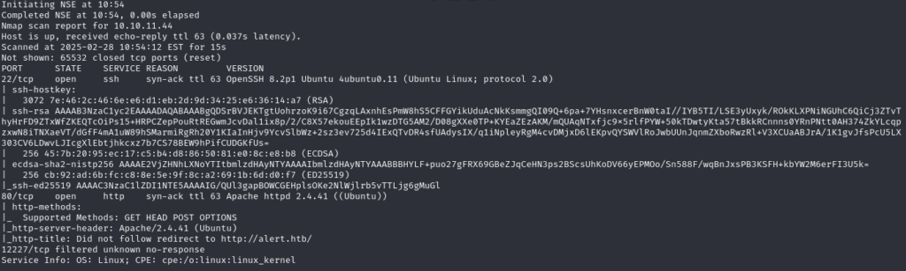
We can see from the results that `port 80` uses `Apache httpd 2.4.41` and redirects to https://alert.htb/. We also have `ssh` on `port 22`.
## `Alert.htb` Enumeration
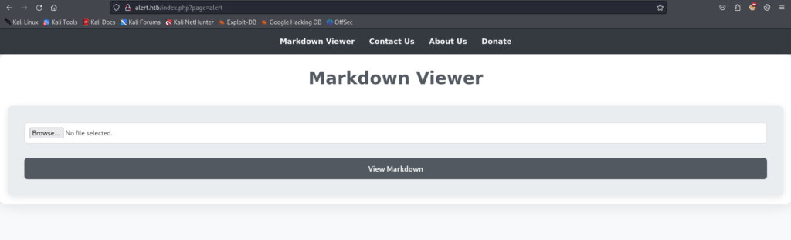
After adding the redirect domain to `/etc/hosts`, we can observe that there is a markdown file upload field.

Further navigating to the `About Us` page also reveals the following message, indicating that the contact form on the website may have an automated system that interacts with the form thus indicating a possible `XSS` or `XSS via interaction`.
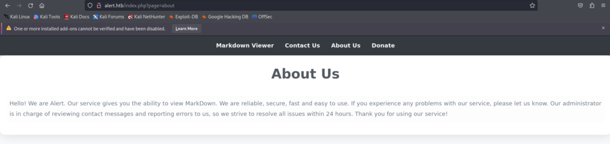
Upon uploading the test script to the `Markdown Viewer`, and viewing it through the browser we can see that the system allows us to inject `javascript` code to the website, thus confirming `XSS`.
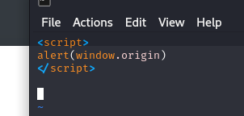
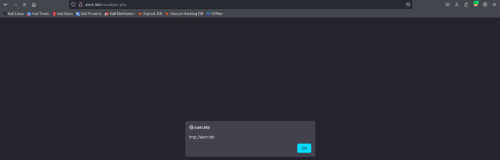
A manual and automated directory enumeration also revealed additional `/messages/`, `/uploads/`, `messages.php`, `visualization.php` that exists in this website.
````bash
gobuster dir –url http://alert.htb -w /usr/share/dirb/wordlists/common.txt
````
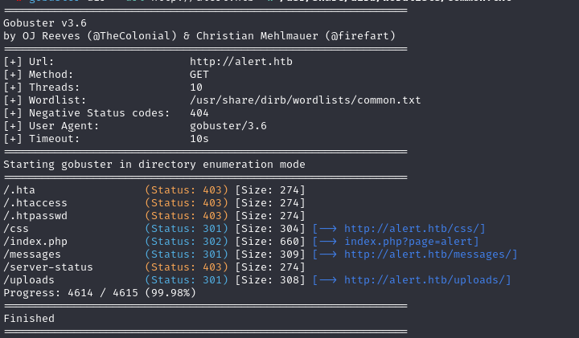
## Subdomain Enumeration
Further subdomain enumeration via `wfuzz` show that the server uses a subdomain called `statistics`. (Due note, we have to filter the subdomains by word since it is the only parameter that is static therefore `--hw 28`)
````bash
wfuzz -u http://alert.htb -w /usr/share/seclists/Discovery/DNS/subdomains-top1million-110000.txt -H "Host: FUZZ.alert.htb" --hw 28
````
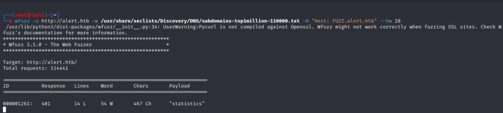
# Foothold
We can now exploit the previously mentioned `XSS` vulnerability by uploading a `javascript` code on the markdown file upload to retrieve contents of files. We first get the contents of `messages.php` and see its contents, after analyzing it we can see that this path (`?file=`) is vulnerable to `Local File Inclusion (LFI)`.
I have created a simple `PHP handler` for the purposes of this vulnerability.
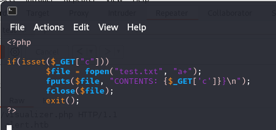
We then can access `/etc/passwd` through;
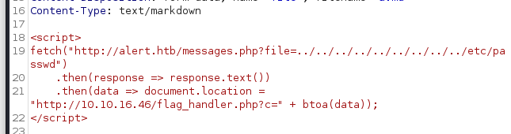
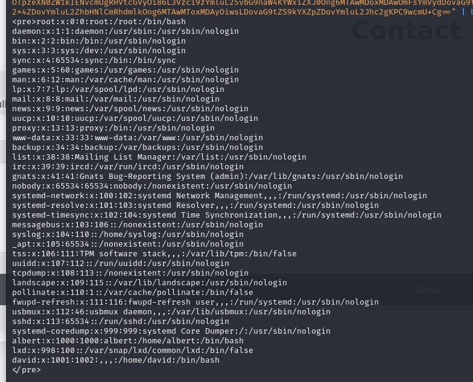
Using the same exploit, I then proceeded to retrieve the config files of apache2 (`/etc/apache2/sites-enabled/000-default.conf`) where we can see the exact location of `.htpasswd` that restricts the subdomain `statistics.alert.htb`.
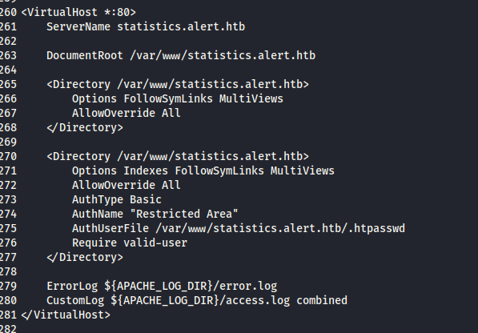
After identifying the existence of `.htpasswd`, we then retrieve it, again, using the same exploit where we receive the user albert and the password hash (clipped in accordance with HTB ToS).
````bash
albert:<SNIP>
````
We then proceed to retrieve the password through this hash using `hashcat`.
````bash
hashcat hash.txt --show
````
We then, as it is standard practice to enumerate, try this credentials on SSH port and successfully login as user `albert`. We can then cat `user.txt`!!!
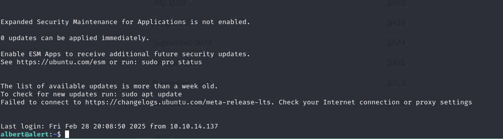
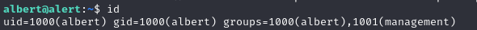
# Privilege Escalation
Now that we have user privileges, we can look up active processes that run on root. There we see an interesting `PHP` process that uses (is bound to) `127.0.0.1:8080` which runs at `/opt/website-monitor`.
````bash
ps aux | grep "root"
````
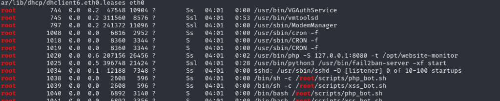
We can then locate to `/opt/website-monitor/` where we see an interesting misconfiguration of permissions of folder `config`. We appear to have write privileges, as we are also in the group `management`.
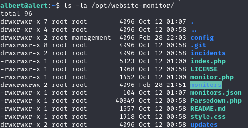
Since the `PHP` process that runs this script is launched through the user `root`, we can easily write a simple `PHP RCE` and get the contents of `root.txt`.
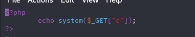
We should also not forget that we have to forward the port 8080 to our host to be able to navigate to the website.
````bash
ssh -L 8000:alert.htb:8080 albert@albert.htb
````
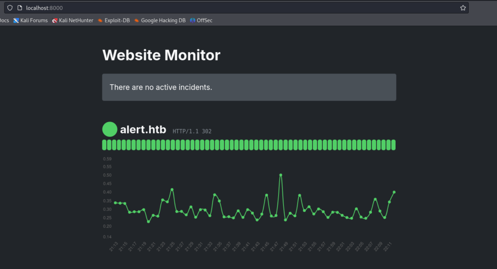
We can then locate to our script and get the contents of `root.txt`.
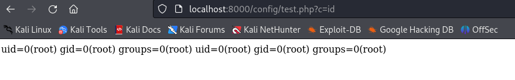


> Happy Hunting